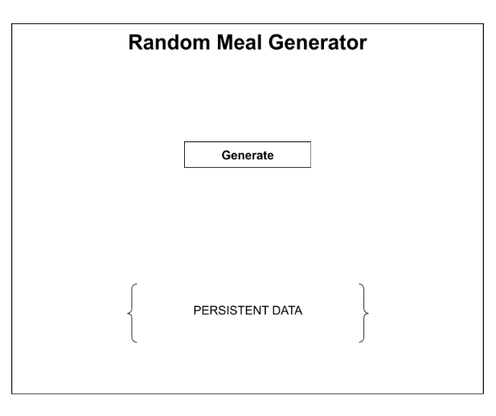
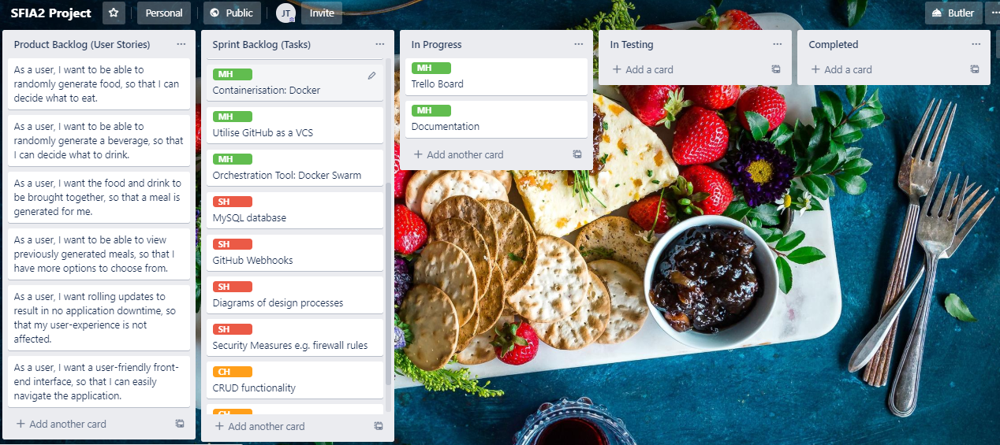
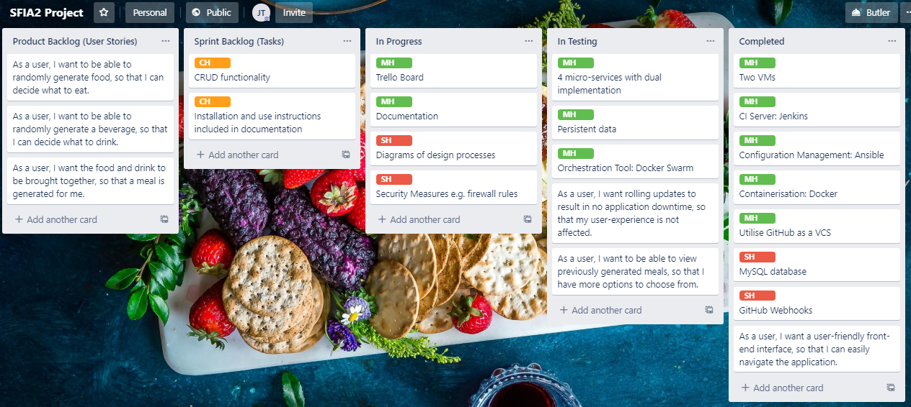
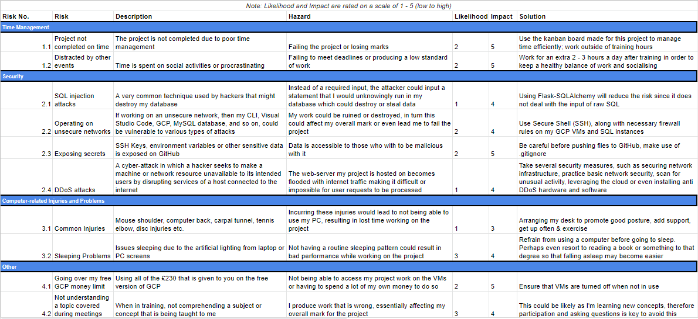
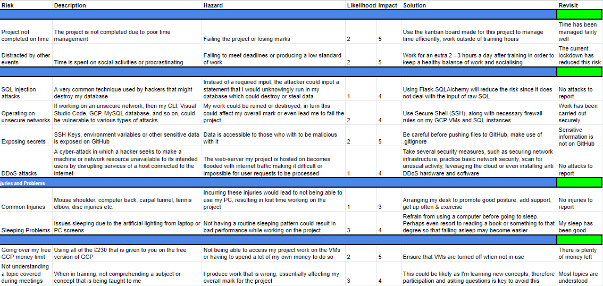
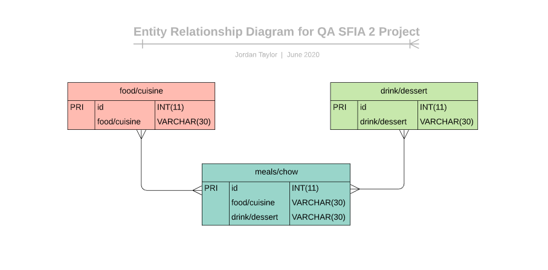
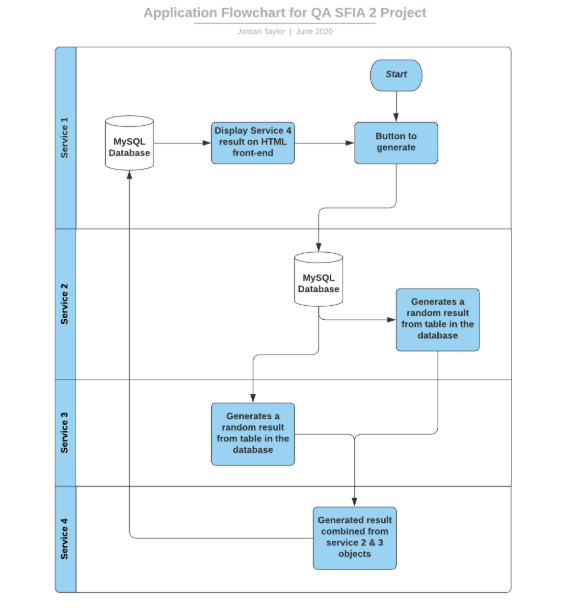

# Random Meal Generator
Following the QAC Practical Project Specification (DevOps) due 15th June 2020.

## Index
1. [Brief](#brief)
    - [Project Proposal](#pp)
2. [Trello Board](#tb)
    - [Initial Board](#ib)
    - [On-going Changes](#ogc)
    - [Final Board](#fb)
3. [Risk Assessment](#risk)
    - [Risk Assessment Revisit](#riskr)
4. [Architecture](#arc)
    - [Entity Relationship Diagram](#erd)
    - [Service Architecture Diagram](#sad)

## Brief
Create an application that randomly generates 'Objects' upon a set of predefined rules. 

The requirements are, however not limited too:
- A micro-service orientated structure involving at least 4 services working together.
- Persisting data in a MySQL database.
- A functioning application implementing the Feature-Branch model 
- Kanban Board: Trello
- Version Control: Git
- Continuous Integration Server: Jenkins 
- Configuration Management: Ansible Playbook
- Multiple GCP Virtual Machines
- Containerisation: Docker
- Orchestration Tool: Docker Swarm 

### Project Proposal 
An application that generates a random meal, more specifically 'food' and 'drink', shown through a front-end website. This will be split across 4 services:
- Service 1: The website. This service is accountable for the display of persistent data. Essentially, a flask application with a single HTML template that communicates with all other services.
- Service 2: Generates 'food' for the user.
- Service 3: Generates 'drink' for the user.
- Service 4: Collects and formats the data from Services 2 & 3, returning it to Service 1 to be displayed. 

#

The above diagram demonstrates how I imagined the user-interface would look like. The 'Generate' button refreshes the page, which re-runs the functions in all services to produce a new outcome. Then, previously generated objects are stored in an external MySQL database, fulfilling the persistent data deliverable in the project brief.

## Trello Board 
A kanban-style Trello Board was used for project tracking. Agile methodology was implemented where possible, in line with the project brief (i.e. Product and Sprint backlogs). However, due to the individual nature of the project, no scrum activities were carried out. Therefore, the work conducted can be described as a single sprint.

The Trello Board can be accessed <a href="https://trello.com/b/RpOSyLLh/sfia2-project">here</a>.

### Initial Board 

I started by adding the required lists, then populating the 'Product Backlog' field with user stories and the 'Sprint Backlog' field with tasks that when completed, would satisfy the user stories. Moreover, MoSCoW prioritisation was utilised by labelling tasks with 'MH' for must have, 'SH' for should have, and 'CH' for could have. This helped me to order the tasks that should be completed first, and which tasks could be completed towards the end of the project within the given timescale.

### On-going Changes 

As the project developed, changes were constantly made to the board. This helped me to keep track of what was in progress, what was finished, and so on. Firstly, completing tasks labelled with MH were my main focus. At this point, all MH tasks were either 'In Progress', 'In Testing' or 'Completed'. Some SH tasks were completed and others in progress. CH tasks were still to do, following the MoSCoW model. Secondly, a few user stories were either fulfilled or in testing as a result in finalising or testing certain features of the overall application. Finally, several issues were encountered during project progression. These were listed in the 'issues' tab of this repository.

### Final Board 

## Risk Assessment 
The risk assessment involved the following types of risks: Time Management, Security, Computer-related Injuries and Other.

### Risk Assessment Revisit 
The initial risk assessment was revisited during project progression. A 'Revisit' column was added, discussing how effective the original solutions had been.

## Architecture 
### Entity Relationship Diagram 

To keep this section concise, both implementations for this project share the above ERD, as they have the same structure. The first implementation is on the left of the '/', the second on the right.

The architecture for the MySQL database encompasses three tables, all made through Flask. The red table represents the first randomly generated object, whereas the green table shows the second randomly generated object. Both these tables were pre-populated with entries respective of their names, for example 'Sushi' in the 'food' table, and 'Fanta' in the 'drink' table. Code was written in Python, using the Random module, to randomly pick an object out of 20 entries for each table. Then, once both objects had been generated they were stored in the blue table that then displays the output onto the HTML front-end. 

Futhermore, previous outputs were displayed on the front-end in a table format to adhere to the persistent data criteria in the project brief.

### Service Architecture Diagram 

