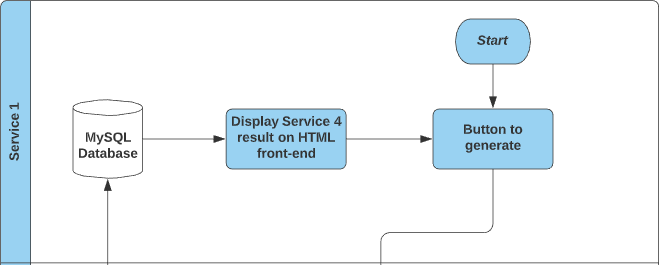
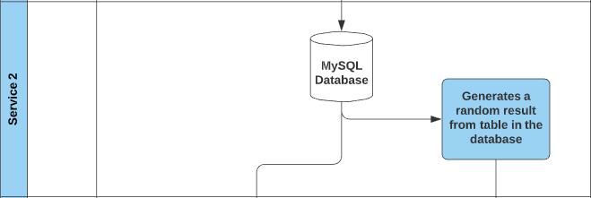
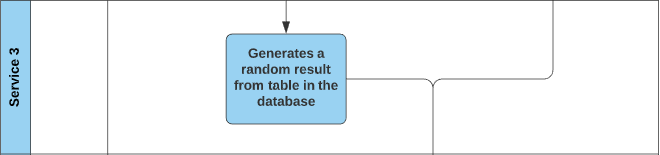
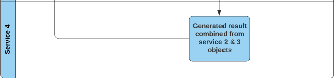
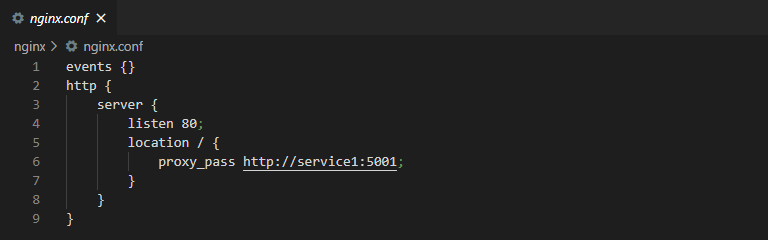
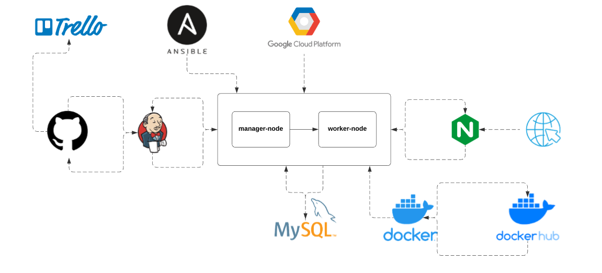
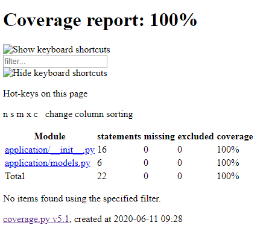

# Random Meal Generator
Following the QAC Practical Project Specification (DevOps) due 15th June 2020.

## Index
1. [Brief](#brief)
    - [Project Proposal](#pp)
2. [Trello Board](#tb)
    - [Initial Board](#ib)
    - [On-going Changes](#ogc)
    - [Final Board](#fb)
3. [Risk Assessment](#risk)
    - [Risk Assessment Revisit](#riskr)
4. [Architecture](#arc)
    - [Entity Relationship Diagram](#erd)
    - [Service Architecture Diagram](#sad)
        + [Service 1](#s1)
        + [Service 2](#s2)
        + [Service 3](#s3)
        + [Service 4](#s4)
    - [System Security](#ss)
5. [Deployment](#deploy)
    - [List of Tools, Technologies and Languages](#ttl)
6. [Testing](#testing)
    - [Pytest](#pytest)
    - [Mocking](#mock)

## Brief
Create an application that randomly generates 'Objects' upon a set of predefined rules. 

The requirements are, however not limited too:
- A micro-service orientated structure involving at least 4 services working together.
- Persisting data in a MySQL database.
- A functioning application implementing the Feature-Branch model 
- Kanban Board: Trello
- Version Control: Git
- Continuous Integration Server: Jenkins 
- Configuration Management: Ansible Playbook
- Multiple GCP Virtual Machines
- Containerisation: Docker
- Orchestration Tool: Docker Swarm 

### Project Proposal 
An application that generates a random meal, more specifically 'food' and 'drink', shown through a front-end website. This will be split across 4 services:
- Service 1: The website. This service is accountable for the display of persistent data. Essentially, a flask application with a single HTML template that communicates with all other services.
- Service 2: Generates 'food' for the user.
- Service 3: Generates 'drink' for the user.
- Service 4: Collects and formats the data from Services 2 & 3, returning it to Service 1 to be displayed. 

#

The above diagram demonstrates how I imagined the user-interface would look like. The 'Generate' button refreshes the page, which re-runs the functions in all services to produce a new outcome. Then, previously generated objects are stored in an external MySQL database, fulfilling the persistent data deliverable in the project brief.

## Trello Board 
A kanban-style Trello Board was used for project tracking. Agile methodology was implemented where possible, in line with the project brief (i.e. Product and Sprint backlogs). However, due to the individual nature of the project, no scrum activities were carried out. Therefore, the work conducted can be described as a single sprint.

The Trello Board can be accessed <a href="https://trello.com/b/RpOSyLLh/sfia2-project">here</a>.

### Initial Board 

I started by adding the required lists, then populating the 'Product Backlog' field with user stories and the 'Sprint Backlog' field with tasks that when completed, would satisfy the user stories. Moreover, MoSCoW prioritisation was utilised by labelling tasks with 'MH' for must have, 'SH' for should have, and 'CH' for could have. This helped me to order the tasks that should be completed first, and which tasks could be completed towards the end of the project within the given timescale.

### On-going Changes 

As the project developed, changes were constantly made to the board. This helped me to keep track of what was in progress, what was finished, and so on. Firstly, completing tasks labelled with MH were my main focus. At this point, all MH tasks were either 'In Progress', 'In Testing' or 'Completed'. Some SH tasks were completed and others in progress. CH tasks were still to do, following the MoSCoW model. Secondly, a few user stories were either fulfilled or in testing as a result in finalising or testing certain features of the overall application. Finally, several issues were encountered during project progression. These were listed in the 'issues' tab of this repository.

### Final Board 

## Risk Assessment 
The risk assessment involved the following types of risks: Time Management, Security, Computer-related Injuries and Other.

### Risk Assessment Revisit 
The initial risk assessment was revisited after project completion. A 'Revisit' column was added, discussing how effective the original solutions had been.

## Architecture 
### Entity Relationship Diagram 

To keep this section concise, both implementations for this project share the above ERD, as they have the same structure. The first implementation is on the left of the '/', the second on the right.

The architecture for the MySQL database encompasses three tables, all made through Flask. The red table represents the first randomly generated object, whereas the green table shows the second randomly generated object. Both these tables were pre-populated with entries respective of their names, for example 'Sushi' in the 'food' table, and 'Fanta' in the 'drink' table. Code was written in Python, using the Random module, to randomly pick an object out of 20 entries for each table. Then, once both objects had been generated they were stored in the blue table that then displays the output onto the HTML front-end. 

Futhermore, previous outputs were displayed on the front-end in a table format to adhere to the persistent data criteria in the project brief.

### Service Architecture Diagram 
#

#### Service 1 
#

This service acts as the front-end website, and is what users will see when they access the server. Just like the SFIA 1 front-end, this service utilises HTML, Jinja2 and Flask. Additionally, this service displays persistent data in the form of a table. This data is pulled from the 'blue' table (meals/chow), mentioned previously. My application starts when the user accesses the page, then the 'Generate' button can be used to ultimately refresh the page, so that all services run again to produce a new outcome. To note, the MySQL database is external from all services, but they all interact with the database directly. 

#### Service 2 
#

When the button is clicked, Service 2 will then run. Code within this service is written so that the first object is generated by querying the table by an entry ID. The ID is equal to a number in range of 1 - 20, selected randomly by taking advantage of the 'randint' function within the Random module.

#### Service 3 
#

Service 3 follows the same procedure as Service 2.

#### Service 4 
#

Service 4 merges the results of Service 2 & 3 and stores them in a different table. The new entry, consisting of the objects generated in the aforementioned services, is then referenced in Service 1 and displayed to the user. Furthermore, the same entry, along with all other entries, can then be seen in the table that is persisting data.

### System Security 
#

In terms of security for the application, several measures were put in place. First, a new tool that we studied during training was NGINX. NGINX allows you to upstream a particular port in use, redirecting or hiding other ports that you don't want the open internet to have access to. So, from the image above, it can be seen that the open internet only have access to port 80 when directing to the server. Ports 5001, 5002, 5003 and 5004, used for the application services, cannot be accessed thus improving security for the application.

What's more, a number of firewall rules were put in place on the GCP VM instances. For example, port 22 was opened up on the worker-node, however on the manager-node had access to it. This was so the manager-node could SSH into the worker-node, to see if the containers had been load-balanced, and so that Ansible (installed on the manager-node) could install dependencies via the Playbook.yaml anb Inventory.cfg. Further more, connection rules were used for the MySQL database so that only the nodes used for this project could access them.

## Deployment 

### List of Tools, Technologies and Languages 
- <b>Trello Board</b>: Project Tracking
- <b>GitHub</b>: Version Control System
- <b>Jenkins</b>: CI Server
- <b>Ansible</b>: Configuration Management
- <b>Google Cloud Platform</b>: Live Environment & MySQL Database Host
- <b>MySQL</b>: SQL Database
- <b>Docker</b>: Containerisation
- <b>Docker Swarm & Stack</b>: Orchestration
- <b>DockerHub</b>: Version Control for Docker Images and Containers
- <b>NGINX</b>: Security and Load-balancing
- <b>Visual Studio Code</b>: IDE for front-end and back-end development. Used the following languages:
    - <b>Python3</b>: Logic and Functionality
    - <b>HTML</b>: Front-end design
    - <b>CSS</b>: Front-end styling
    - <b>Flask</b>: Connects front-end and back-end
    - <b>MySQLAlchemy</b>: Accesses MySQL Database with query-based functions
    - <b>Jinja2</b>: Allows variables to be passed between Python3 and HTML

## Testing 
### Pytest 

As I have experience using Pytest in the last project, I was able to transfer the same skills over to this one. The tests involved testing the URLs to ensure that the VMs were hosting the application, as well as SQL functionality to prove I could connect to my database, and finally, getting responses from each service to make sure the HTTP requests were working properly. Overall, I achieved 100% coverage on all services.

#

The image above is the coverage report for Service 1. Coverage reports for all services can be found within their respective folder names, e.g. 'service_3', under the 'test_results' folder.

### Mocking 

'Mock Tests' were also used. Mocking, from the requests and unittest modules, allows you to assert a value that should return when testing a HTTP request response. Therefore, as the URLs for this are containerised using Docker, Pytest cannot access them, hence why mocking is used. Below is an example mock test I used for Service 4.

